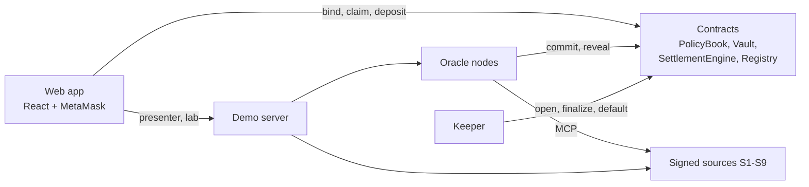

# TIES

Threshold-indexed parametric insurance for flight delays and rainfall, running on an EVM chain.
Users bind policies on an event, oracle rounds produce an evidence interval, and policies on either
side of that interval settle in range operations rather than one by one.

## Architecture



Details: [docs/ARCHITECTURE.md](docs/ARCHITECTURE.md).

## Prerequisites

- Node.js 22 (see `.nvmrc`) and npm 10+
- MetaMask in a desktop browser
- Internet access only for the real-weather source (Open-Meteo, no API key)

## Quick start

```bash
npm install
npm run lint
npm test
npm run build
```

Start the local chain and services (terminal 1), then the web app (terminal 2):

```bash
npm run dev:stack
```

```bash
npm run dev:web
```

Open http://localhost:5173, add the Hardhat Localhost network to MetaMask (the app offers to) and
import the development accounts printed by the `node` process. The Docs & FAQ screen explains
the accounts; the Presenter screen drives time and the services.

A scenario can also run from the command line while the stack is up:

```bash
npm run demo:cli -- --scenario compromised-feed
```

## Documentation

| Document                                         | Contents                                              |
| ------------------------------------------------ | ----------------------------------------------------- |
| [docs/RUNNING.md](docs/RUNNING.md)               | Services, ports, accounts, scenarios, configuration   |
| [docs/ARCHITECTURE.md](docs/ARCHITECTURE.md)     | Components, event lifecycle, repository layout        |
| [docs/CONTRACTS.md](docs/CONTRACTS.md)           | Contract API, events, gas and sizes                   |
| [docs/SECURITY.md](docs/SECURITY.md)             | Threat model, edge cases, static analysis             |
| [docs/EXPERIMENTS.md](docs/EXPERIMENTS.md)       | Comparison with baseline designs, generated from runs |
| [docs/DEMO_SCRIPT.md](docs/DEMO_SCRIPT.md)       | A seven-minute live demo with MetaMask                |
| [docs/DESIGN_MAPPING.md](docs/DESIGN_MAPPING.md) | Design placeholders mapped to contract calls          |
| [PROGRESS.md](PROGRESS.md)                       | Milestone log                                         |

## Repository layout

| Path                 | Contents                                                    |
| -------------------- | ----------------------------------------------------------- |
| `contracts/`         | Solidity 0.8.24 contracts                                   |
| `test/`              | Hardhat tests                                               |
| `scripts/`           | Deploy, seed and ABI export scripts, command-line demo      |
| `packages/ties-math` | TypeScript reference implementation of the settlement maths |
| `services/`          | Source servers, oracle nodes, keeper, demo server           |
| `experiments/`       | Scenarios, experiment runner, charts, report                |
| `frontend/`          | React + Vite + TypeScript web app                           |
| `docs/`              | Documentation                                               |
