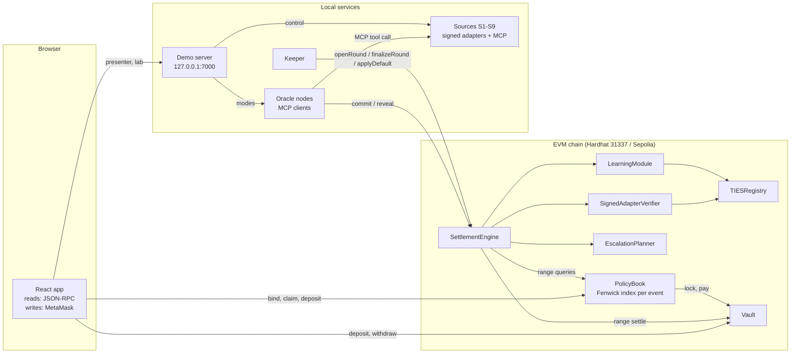
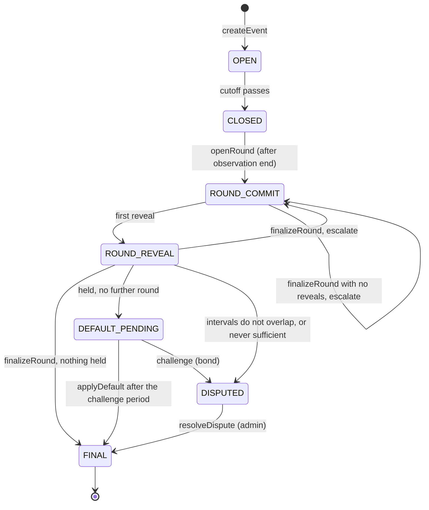

# Architecture

TIES is a parametric insurance system for flight delays and 24-hour rainfall. The contracts hold
all money and make every settlement decision. The off-chain services only fetch signed data and
keep things moving. The web app reads the chain and sends transactions through MetaMask.

## Contracts

| Contract                | Holds                                                                                              |
| ----------------------- | -------------------------------------------------------------------------------------------------- |
| `Vault`                 | All ETH. LP shares; free, locked and claimable accounting.                                         |
| `TIESRegistry`          | Versioned category parameters, sources (signer key, tool hashes), oracles, reputation, dependence. |
| `PolicyBook`            | Events, policies, quotes, capacity checks and the Fenwick tree of locked collateral per event.     |
| `SettlementEngine`      | Rounds (commit, reveal, finalize), the running interval, range settlement, defaults, disputes.     |
| `SignedAdapterVerifier` | Recovers the source from a report signature and checks tool hash, category and timestamp.          |
| `EscalationPlanner`     | View contract: decides whether to escalate and ranks oracles to recruit.                           |
| `LearningModule`        | Reputation and dependence updates when an event is final.                                          |

The full API, events, gas and sizes are in [CONTRACTS.md](CONTRACTS.md). The threat model is in
[SECURITY.md](SECURITY.md).

## Life of an event

1. **Binding.** `PolicyBook.bind` checks the cutoff, the bucket and the premium (the contract's own
   quote), then the three capacity limits. It adds the payout to the event's Fenwick tree at the
   threshold bucket, locks the payout in the vault and forwards the premium.
2. **Evidence.** After the observation window the keeper opens round 1 with the primary oracles.
   Each oracle calls its source's MCP tool, gets a value signed by the source key, commits to it
   and reveals it. The verifier recovers the source from the signature.
3. **Aggregation.** `finalizeRound` combines every report so far: a reputation-weighted median, an
   agreement weight per report, the consensus V, the dispersion, and the effective number of
   independent sources N_eff (reports from one source count once; learned dependence between
   sources lowers it). The uncertainty of V shrinks only as N_eff grows.
4. **Settlement.** The round's interval narrows the running interval [L, U]. Everything with a
   threshold at or below L becomes claimable and everything above U is released, each with one
   range query on the Fenwick tree. Only collateral inside [L, U] stays held.
5. **Escalation.** If too much is still held and rounds remain, the planner recruits oracles whose
   sources are not yet represented, ranked by how much they would raise N_eff times their
   reputation. Otherwise the event goes to a challengeable default, or to the admin if no round
   ever had enough independent evidence.
6. **Claims and learning.** A holder claims a paying policy in one transaction. When the event is
   final, oracle reputation and source dependence are updated for later events.

## Off-chain services

| Service      | Port          | Role                                                                       |
| ------------ | ------------- | -------------------------------------------------------------------------- |
| Hardhat node | 8545          | Local chain (31337).                                                       |
| Sources      | 7101-7109     | Signed upstream data over MCP; S7 calls the real Open-Meteo archive.       |
| Oracle nodes | 7200 (status) | Keys #10-#17; MCP client, commit, reveal; modes for failure scenarios.     |
| Keeper       | -             | Opens and finalizes rounds and applies defaults when they are due.         |
| Demo server  | 7000          | Presenter API: reset, time travel, modes, scenarios, experiments over SSE. |

None of them is trusted by the contracts. A wrong or missing keeper call delays settlement but
cannot change it; an oracle can only relay what a registered source signed.

## Repository layout

| Path                 | Contents                                                                         |
| -------------------- | -------------------------------------------------------------------------------- |
| `contracts/`         | Solidity contracts (`core`, `libraries`, `verifiers`, `baselines`, test `mocks`) |
| `test/`              | Hardhat tests, including differential tests against `ties-math`                  |
| `packages/ties-math` | TypeScript reference implementation of the settlement maths                      |
| `services/`          | `sources`, `oracle-node`, `keeper`, `demo-server`, `shared`                      |
| `scripts/`           | Deploy, seed, ABI export, command-line scenario runner                           |
| `experiments/`       | Scenarios, experiment runner, charts, report generator                           |
| `frontend/`          | React + Vite + TypeScript app                                                    |
| `docs/`              | This document and the others listed in the README                                |
