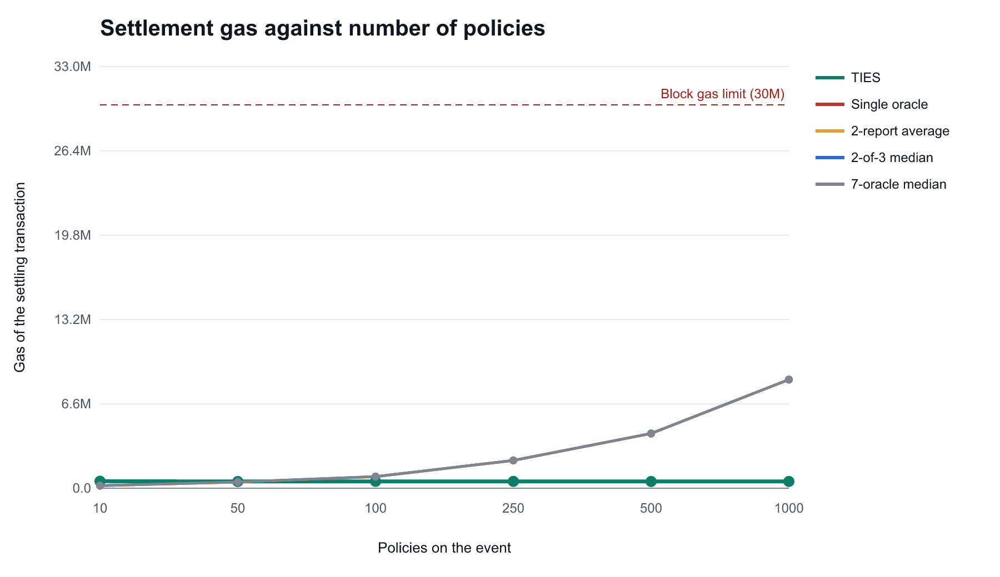
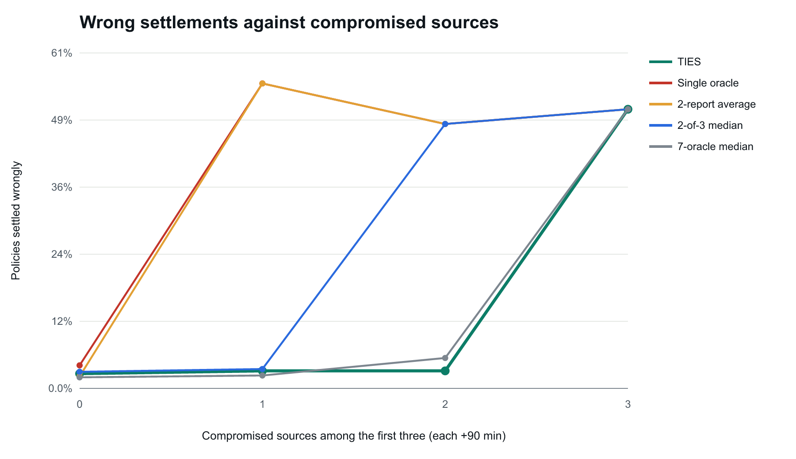
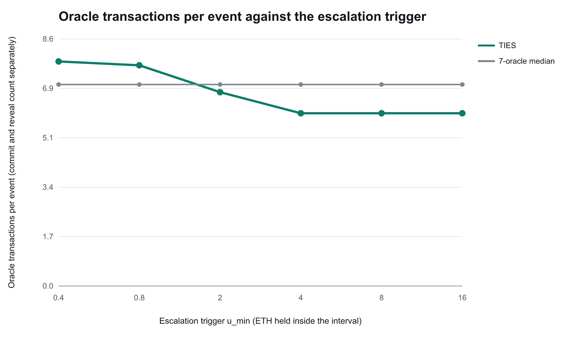
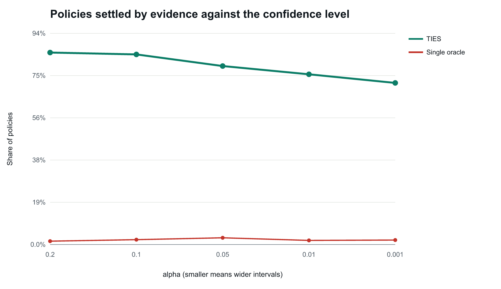

# Experiments

Generated from `experiments/results/summary.json` by `npm run experiments:report`. Do not edit by hand.

Run: 2026-10-07T15:47:36.873Z, 100 events x 20 policies per scenario, sweeps of 30 events, seed 1, 0.4 ETH payout per policy, hardhat in-process, chain 31337. Elapsed 974 s.

## Method

- Every number comes from real transactions and receipts on the in-process Hardhat network. TIES runs the full contracts (commit, reveal, aggregation, range settlement, escalation, default). Each baseline is its own contract with its own pool and a per-policy `settleAll` loop (`contracts/baselines`).
- For each event the ground truth is drawn from 60 to 300 minutes; 20 policies are placed at thresholds within 30 minutes either side of the truth (2 minutes for `borderline`), so many sit close to the truth.
- All systems are fed the same source readings: truth, plus the scenario's offset, plus deterministic Gaussian noise per source (sigma 2 to 4 minutes). Baselines ask the first 1, 2 or 3 oracle keys of the scenario's committee, or seven keys for the 7-oracle median.
- "Wrong" is a policy settled the opposite way from the ground truth (it pays iff the truth is at least its threshold), as a share of all policies. Policies that are not settled (an event waiting for the admin, or a baseline that never reached its quorum) are counted as held, not wrong.
- For TIES, "settled by evidence" means decided by the running interval before any default; "by default" means decided by the default rule after the challenge period; "held" means still undecided (disputed, waiting for the admin).
- Oracle transactions count commits and reveals separately for TIES (a reveal that reverts still counts); a baseline report is one transaction.
- Each scenario uses a fresh deployment, so reputations and learned dependence carry from one event to the next within a scenario.

Notes recorded by the runner:

- Each scenario uses a fresh deployment; reputations and dependence learned in one event carry into the next.
- Baselines receive the same source readings as TIES. A forged report is accepted by a baseline (no source signature) and rejected by TIES.
- BaselineMedian7 asks seven oracle keys: six distinct sources plus a second key on S2, because flight data has only six sources.
- Disputed events are left for the admin: their policies count as held, not as wrong.
- Late oracles are modelled as not revealing (their reveal would revert after the window).
- Policies are bound by three rotating holders. A baseline's per-policy loop gets cheaper when holders repeat (warm storage), so baseline settle gas here is a lower bound.
- Claims are not measured: TIES pays out one claim transaction per paying policy; the baselines pay one claim per holder.

## Scenarios

### Wrong settlements (share of all policies)

| Scenario              | TIES  | Single oracle | 2-report average | 2-of-3 median | 7-oracle median |
| --------------------- | ----- | ------------- | ---------------- | ------------- | --------------- |
| `honest`              | 1.6%  | 2.3%          | 2.2%             | 2.5%          | 1.8%            |
| `compromised-feed`    | 1.5%  | 2.4%          | 49.5%            | 49.5%         | 2.5%            |
| `two-keys-one-feed`   | 2.3%  | 2.5%          | 1.9%             | 3.6%          | 2.0%            |
| `noisy-source`        | 1.8%  | 2.9%          | 2.4%             | 2.8%          | 1.8%            |
| `late-source`         | 2.1%  | 2.6%          | 2.6%             | 2.6%          | 0.0%            |
| `silent-source`       | 1.8%  | 3.0%          | 2.6%             | 2.6%          | 0.0%            |
| `unavailable-source`  | 2.0%  | 2.8%          | 2.3%             | 2.3%          | 0.0%            |
| `borderline`          | 28.1% | 30.6%         | 27.2%            | 28.4%         | 26.2%           |
| `forged-report`       | 1.7%  | 2.2%          | 49.5%            | 2.7%          | 2.0%            |
| `inconsistent-rounds` | 1.8%  | 2.9%          | 1.9%             | 1.8%          | 3.6%            |

### TIES: how policies were decided

| Scenario              | By evidence | By default | Held | Wrong among evidence-settled | Wrong among defaulted | Rounds per event | Round 1 insufficient |
| --------------------- | ----------- | ---------- | ---- | ---------------------------- | --------------------- | ---------------- | -------------------- |
| `honest`              | 76.6%       | 23.4%      | 0.0% | 0.0%                         | 6.6%                  | 1.20             | 0.0%                 |
| `compromised-feed`    | 73.2%       | 26.8%      | 0.0% | 0.0%                         | 5.6%                  | 2.95             | 100.0%               |
| `two-keys-one-feed`   | 73.5%       | 26.5%      | 0.0% | 0.0%                         | 8.5%                  | 2.15             | 100.0%               |
| `noisy-source`        | 68.0%       | 32.0%      | 0.0% | 0.0%                         | 5.6%                  | 1.80             | 47.0%                |
| `late-source`         | 74.1%       | 25.9%      | 0.0% | 0.0%                         | 8.3%                  | 2.13             | 100.0%               |
| `silent-source`       | 74.1%       | 25.9%      | 0.0% | 0.0%                         | 6.9%                  | 2.11             | 100.0%               |
| `unavailable-source`  | 74.4%       | 25.6%      | 0.0% | 0.0%                         | 7.8%                  | 2.15             | 100.0%               |
| `borderline`          | 0.0%        | 100.0%     | 0.0% | 0.0%                         | 28.1%                 | 1.02             | 0.0%                 |
| `forged-report`       | 74.0%       | 26.0%      | 0.0% | 0.0%                         | 6.5%                  | 2.14             | 100.0%               |
| `inconsistent-rounds` | 75.0%       | 24.9%      | 0.0% | 0.0%                         | 7.2%                  | 1.04             | 0.0%                 |

### Share of policies that were settled at all

A baseline that never reaches its quorum leaves its policies unsettled, which the wrong-settlement table counts as not wrong. Read the two tables together.

| Scenario              | TIES   | Single oracle | 2-report average | 2-of-3 median | 7-oracle median |
| --------------------- | ------ | ------------- | ---------------- | ------------- | --------------- |
| `honest`              | 100.0% | 100.0%        | 100.0%           | 100.0%        | 100.0%          |
| `compromised-feed`    | 100.0% | 100.0%        | 100.0%           | 100.0%        | 100.0%          |
| `two-keys-one-feed`   | 100.0% | 100.0%        | 100.0%           | 100.0%        | 100.0%          |
| `noisy-source`        | 100.0% | 100.0%        | 100.0%           | 100.0%        | 100.0%          |
| `late-source`         | 100.0% | 100.0%        | 100.0%           | 100.0%        | 0.0%            |
| `silent-source`       | 100.0% | 100.0%        | 100.0%           | 100.0%        | 0.0%            |
| `unavailable-source`  | 100.0% | 100.0%        | 100.0%           | 100.0%        | 0.0%            |
| `borderline`          | 100.0% | 100.0%        | 100.0%           | 100.0%        | 100.0%          |
| `forged-report`       | 100.0% | 100.0%        | 100.0%           | 100.0%        | 100.0%          |
| `inconsistent-rounds` | 100.0% | 100.0%        | 100.0%           | 100.0%        | 100.0%          |

### Oracle transactions per event

| Scenario              | TIES  | Single oracle | 2-report average | 2-of-3 median | 7-oracle median |
| --------------------- | ----- | ------------- | ---------------- | ------------- | --------------- |
| `honest`              | 6.64  | 1.00          | 2.00             | 3.00          | 7.00            |
| `compromised-feed`    | 10.04 | 1.00          | 2.00             | 3.00          | 7.00            |
| `two-keys-one-feed`   | 8.58  | 1.00          | 2.00             | 3.00          | 7.00            |
| `noisy-source`        | 8.02  | 1.00          | 2.00             | 3.00          | 7.00            |
| `late-source`         | 7.46  | 1.00          | 2.00             | 2.00          | 6.00            |
| `silent-source`       | 7.48  | 1.00          | 2.00             | 2.00          | 6.00            |
| `unavailable-source`  | 6.52  | 1.00          | 2.00             | 2.00          | 6.00            |
| `borderline`          | 6.08  | 1.00          | 2.00             | 3.00          | 7.00            |
| `forged-report`       | 8.46  | 1.00          | 2.00             | 3.00          | 7.00            |
| `inconsistent-rounds` | 6.12  | 1.00          | 2.00             | 3.00          | 7.00            |

### Gas per event

| Scenario              | TIES oracle gas | TIES settle gas (all rounds and default) | TIES settle gas per policy | Single oracle settleAll | 2-report average settleAll | 2-of-3 median settleAll | 7-oracle median settleAll |
| --------------------- | --------------- | ---------------------------------------- | -------------------------- | ----------------------- | -------------------------- | ----------------------- | ------------------------- |
| `honest`              | 684,714         | 1,221,145                                | 61,057                     | 223,497                 | 225,842                    | 240,250                 | 244,759                   |
| `compromised-feed`    | 1,027,551       | 2,886,404                                | 144,320                    | 223,487                 | 223,244                    | 237,108                 | 244,495                   |
| `two-keys-one-feed`   | 880,237         | 2,098,700                                | 104,935                    | 223,360                 | 225,776                    | 239,910                 | 244,625                   |
| `noisy-source`        | 823,642         | 1,865,845                                | 93,292                     | 223,366                 | 225,734                    | 240,029                 | 244,745                   |
| `late-source`         | 724,968         | 1,991,175                                | 99,559                     | 223,433                 | 225,844                    | 239,843                 | n/a (never settled)       |
| `silent-source`       | 726,926         | 1,976,588                                | 98,829                     | 223,466                 | 225,828                    | 239,787                 | n/a (never settled)       |
| `unavailable-source`  | 672,144         | 1,999,692                                | 99,985                     | 223,389                 | 225,721                    | 239,689                 | n/a (never settled)       |
| `borderline`          | 628,461         | 1,125,996                                | 56,300                     | 219,254                 | 222,855                    | 237,185                 | 242,511                   |
| `forged-report`       | 786,170         | 2,000,333                                | 100,017                    | 223,451                 | 223,244                    | 240,336                 | 245,789                   |
| `inconsistent-rounds` | 632,492         | 1,108,556                                | 55,428                     | 223,372                 | 225,850                    | 240,114                 | 243,602                   |

### Gas to bind one policy

TIES pays for the threshold index and the capacity checks at binding time; the baselines only store the policy.

| Scenario              | TIES    | Single oracle | 2-report average | 2-of-3 median | 7-oracle median |
| --------------------- | ------- | ------------- | ---------------- | ------------- | --------------- |
| `honest`              | 377,683 | 88,747        | 88,747           | 88,747        | 88,725          |
| `compromised-feed`    | 377,683 | 88,747        | 88,747           | 88,747        | 88,725          |
| `two-keys-one-feed`   | 377,683 | 88,747        | 88,747           | 88,747        | 88,725          |
| `noisy-source`        | 377,683 | 88,747        | 88,747           | 88,747        | 88,725          |
| `late-source`         | 377,683 | 88,747        | 88,747           | 88,747        | 87,878          |
| `silent-source`       | 377,683 | 88,747        | 88,747           | 88,747        | 87,878          |
| `unavailable-source`  | 377,683 | 88,747        | 88,747           | 88,747        | 87,878          |
| `borderline`          | 359,229 | 88,747        | 88,747           | 88,747        | 88,725          |
| `forged-report`       | 377,683 | 88,747        | 88,747           | 88,747        | 88,725          |
| `inconsistent-rounds` | 377,683 | 88,747        | 88,747           | 88,747        | 88,725          |

## Settling gas against the number of policies

| Policies | TIES finalizeRound | TIES applyDefault | Single oracle | 2-report average | 2-of-3 median | 7-oracle median |
| -------- | ------------------ | ----------------- | ------------- | ---------------- | ------------- | --------------- |
| 10       | 549,766            | 518,415           | 190,038       | 192,381          | 206,934       | 210,803         |
| 50       | 527,228            | 479,824           | 476,516       | 478,653          | 493,006       | 499,105         |
| 100      | 537,109            | 474,000           | 898,466       | 900,603          | 915,156       | 921,178         |
| 250      | 535,428            | 494,506           | 2,164,316     | 2,166,659        | 2,181,495     | 2,185,487       |
| 500      | 527,475            | 493,580           | 4,273,654     | 4,276,409        | 4,290,473     | 4,295,160       |
| 1000     | 529,361            | 470,976           | 8,492,948     | 8,495,703        | 8,510,185     | 8,515,678       |

At 1000 policies the single-oracle baseline costs 8,492,948 gas, about 8,493 gas per policy. Extrapolated linearly (not measured), it would reach the 30,000,000 block gas limit at about 3,532 policies. No baseline exceeded the limit in the measured range.

## Sweeps

### Compromised sources (each +90 minutes, among the first three oracle keys)

| Compromised | TIES  | Single oracle | 2-report average | 2-of-3 median | 7-oracle median |
| ----------- | ----- | ------------- | ---------------- | ------------- | --------------- |
| 0           | 2.7%  | 4.2%          | 2.2%             | 3.0%          | 2.0%            |
| 1           | 3.2%  | 55.2%         | 55.2%            | 3.5%          | 2.3%            |
| 2           | 3.2%  | 47.8%         | 47.8%            | 47.8%         | 5.5%            |
| 3           | 50.5% | 50.5%         | 50.5%            | 50.5%         | 50.5%           |

### Escalation trigger u_min

| u_min (ETH) | Oracle txs per event | Rounds per event | Wrong | By evidence |
| ----------- | -------------------- | ---------------- | ----- | ----------- |
| 0.4         | 7.80                 | 1.60             | 2.0%  | 76.7%       |
| 0.8         | 7.67                 | 1.50             | 1.0%  | 77.8%       |
| 2           | 6.73                 | 1.23             | 2.7%  | 76.0%       |
| 4           | 6.00                 | 1.00             | 1.2%  | 75.8%       |
| 8           | 6.00                 | 1.00             | 1.5%  | 76.7%       |
| 16          | 6.00                 | 1.00             | 2.3%  | 76.0%       |

The 7-oracle median always uses 7 oracle transactions.

### Confidence level alpha

| alpha | z (round 1) | By evidence | By default | Wrong | Oracle txs per event |
| ----- | ----------- | ----------- | ---------- | ----- | -------------------- |
| 0.2   | 1.645       | 85.3%       | 14.7%      | 1.5%  | 6.13                 |
| 0.1   | 1.960       | 84.5%       | 15.5%      | 2.2%  | 6.00                 |
| 0.05  | 2.241       | 79.3%       | 20.7%      | 3.0%  | 6.00                 |
| 0.01  | 2.807       | 75.7%       | 24.3%      | 1.8%  | 6.47                 |
| 0.001 | 3.481       | 71.8%       | 28.2%      | 2.0%  | 7.27                 |

